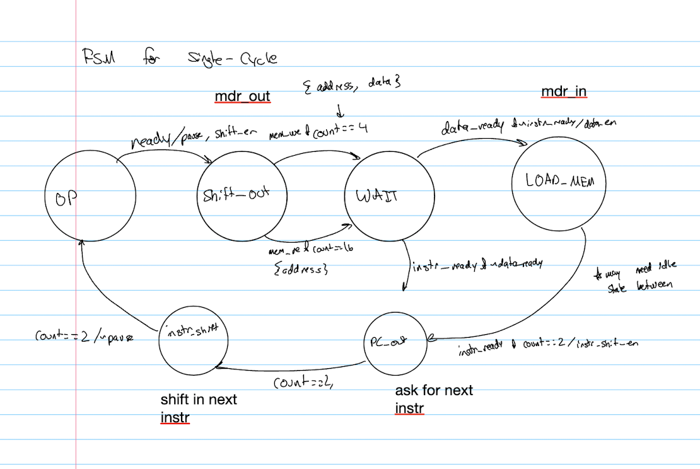
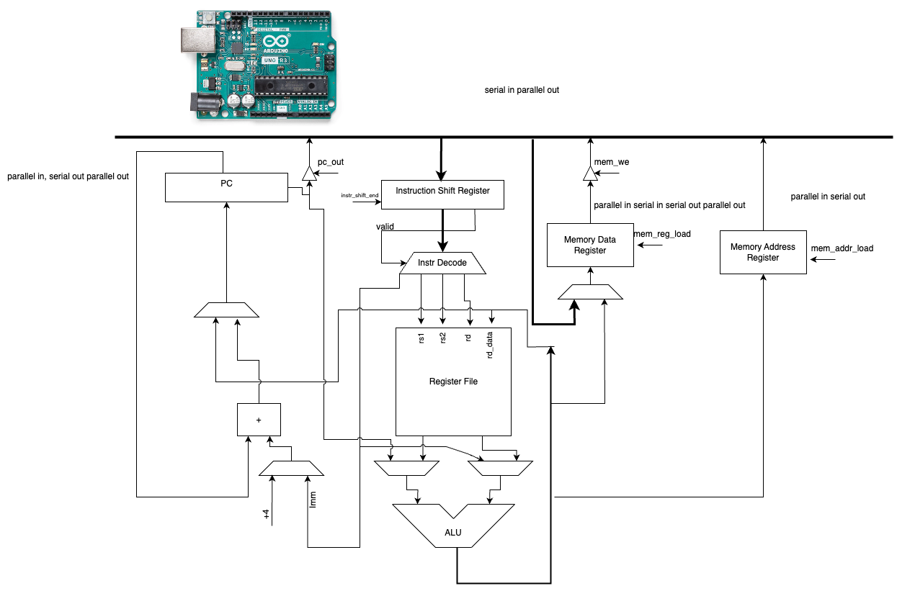

# 16-bit Serial CPU
Gaurav Savant
18-224 Spring 2024 Final Tapeout Project

## Overview
This CPU interacts with an Arduino or Raspberry PI to accomplish standard CPU tasks. The microcontroller acts as a memory interface for the chip, and the chip interacts with the controller by sending a program counter value, data address, and memory address serially through the 8 bit bus (over 2 cycles). The microcontroller then responds with the requested values back serially through the input bus to the chip.
## How it Works
The way this chip works is that there is an input and output bus, and some components to do the computation. There is an ALU, a register file, an instruction register, a PC register, MAR, and MDR registers as well. The PC, MAR, and MDR registers all interact with the bus (reading to it and writing to it) while the other components do the computation. First the pc is sent to the Arduino, and on the cycles afterwards the Arduiino sends back the instruction from that PC. From there, the operation is completed and the output of that instruction is created (whether it is going to the register file, the MDR, MAR, etc). Then that keeps iterating until the SYS_END operation is found. That will terminate the operation of the CPU. 

## Inputs/Outputs
The 12 input pins are the input bus, ard_data_ready, ard_receive_ready, and ard_clk. Remaining are just grounded. The input bus is the bus that the arduino uses to send the values, the ard_data_ready and ard_receive_ready and signals to indicate the status of the Arduino, and ard_clk is controlling the clock on the chip so that it syncs with the clock on the arduino.
## Hardware Peripherals
The only hardware peripheral is the Arduino/Raspberry Pi
## Design Testing / Bringup
In order to test the design, hook up an arduino to the inputs of the chip, and map the pins of the Arduino such that each IO is somewhere you can read from it. Then, just pass instructions to the chip using the included code
